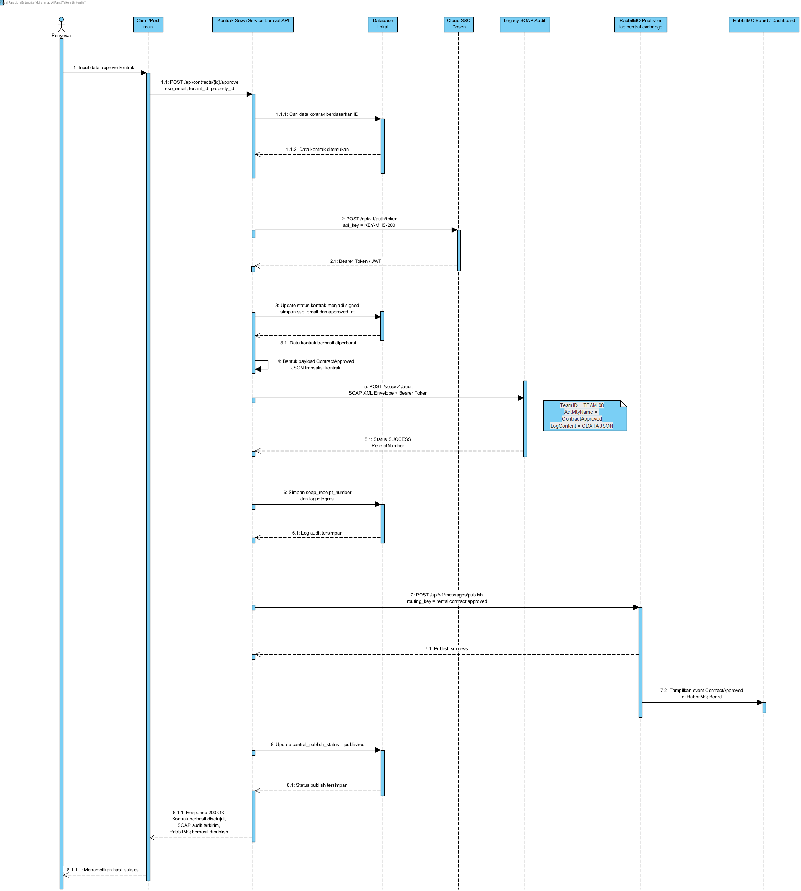

Analisis Tugas 3 – Kontrak Sewa Service
Identitas Service

Nama Service : Kontrak Sewa Service
Nama Mahasiswa : Muhammad Al Faris
NIM : 102022400152
Kelompok : 8
Framework : Laravel
API Key : KEY-MHS-200

Transaksi Kritis

Pada Tugas 3 ini, transaksi kritis yang dipilih adalah proses persetujuan kontrak sewa (ContractApproved) melalui endpoint POST /api/contracts/{id}/approve.

Transaksi ini dipilih karena ketika penyewa menyetujui kontrak, status kontrak berubah dari draft menjadi signed. Perubahan status tersebut menunjukkan bahwa kontrak telah disetujui dan proses penyewaan dapat dilanjutkan.

Integrasi dengan Sistem Pusat
Federated SSO

Service menggunakan Federated SSO untuk memperoleh token akses dari server pusat. Token tersebut digunakan sebagai autentikasi saat mengakses layanan SOAP Audit dan RabbitMQ Publisher.

SOAP Audit

Setelah kontrak disetujui, sistem mengirimkan data transaksi ke layanan SOAP Audit. Dari proses ini sistem menerima ReceiptNumber yang digunakan sebagai bukti bahwa audit transaksi berhasil diterima oleh server pusat.

RabbitMQ Publisher

Selain melakukan audit, service juga mengirimkan event ke RabbitMQ menggunakan routing key rental.contract.approved. Event ini digunakan untuk memberi informasi kepada sistem pusat bahwa kontrak telah disetujui.

Data Transaksi

Data yang dikirim ke sistem pusat berisi informasi utama mengenai kontrak dan aktivitas yang dilakukan, seperti contract_id, tenant_id, property_id, approved_by, dan status kontrak.

Contoh data yang dikirim:

{
  "contract_id": 4,
  "activity": "ContractApproved",
  "tenant_id": "TEN-031",
  "property_id": "PROP-001",
  "approved_by": "warga31@ktp.iae.id",
  "status": "signed"
}

Hasil Pengujian

Pengujian dilakukan menggunakan Postman pada endpoint approve kontrak. Hasil pengujian menunjukkan bahwa request berhasil diproses dengan status 200 OK.

Status kontrak berhasil berubah menjadi signed, SOAP Audit berhasil mengembalikan ReceiptNumber, dan event RabbitMQ berhasil dipublish ke sistem pusat menggunakan routing key yang telah ditentukan.

